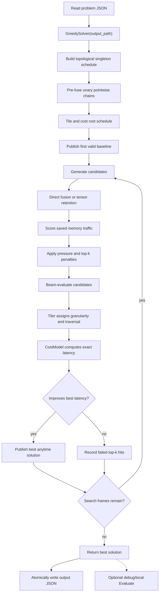

# Algorithm Overview

## Abstract

We solve the MLSys graph scheduling problem as a constrained search over
subgraph partitions, tensor-retention decisions, execution granularities, and
tile traversal orders. Given a directed acyclic graph (DAG) of tensor operations,
the solver constructs a schedule whose total latency is minimized under an
effective fast-memory capacity constraint. The submitted binary uses
`GreedySolver(output_path)`: a bounded lookahead greedy fuser proposes structural
changes, a tiler assigns legal granularities, `CostModel` evaluates exact
estimated latency, and the resulting solution is atomically written to disk. In release
execution, `main.cpp` does not run the evaluator on the critical path; `Evaluate`
is kept as a debug/local validation tool.

## End-to-End Flow

## Search Algorithm

`GreedySolver` is the production path used by `mlsys`. It invokes `GreedyFuser`
with beam width $b=32$, lookahead depth $d=0$, and top-k failure penalty
$\alpha=0.04$; $\alpha=0.16$ is an alternate tuned value with equivalent sweep
results. The solver publishes the first valid baseline immediately through
`AnytimeSolutionWriter`; every later publish must strictly improve the best
exact total latency.

The root state is a topological schedule with one subgraph per op, followed by a
deterministic pre-fusion pass over unary pointwise chains. This pass is safe
because it only accepts merges that preserve local dependency validity. From any
state, the fuser considers pairs $(S_p,S_c)$ where a producer subgraph produces
tensors consumed by a later consumer subgraph. Let

$$
T_{p,c} = \mathrm{produced}(S_p) \cap \mathrm{consumed}(S_c).
$$

For each non-empty $T_{p,c}$, two moves are generated:

1. **Direct fusion:** merge $S_p$ and $S_c$, making newly internalized tensors
   ephemeral when possible.
2. **Retention:** add tensors in $T_{p,c}$ to the retention lists along the
   interval from $S_p$ to $S_c$.

The heuristic score estimates memory traffic saved by a move before paying for
full tiling and exact latency evaluation. For direct fusion,

$$
\Delta_{\mathrm{fuse}} =
2 \cdot \mathrm{internalized}(S_p,S_c),
$$

because a newly internalized tensor can avoid one slow-memory write and one later
slow-memory read. For retention,

$$
\Delta_{\mathrm{retain}} = \sum_{t \in T_{p,c}} W_tH_t,
$$

which models avoiding a later read. Both are converted to a density score

$$
D(\Delta,T)=\frac{\Delta}{\sqrt{|T|}}.
$$

We then penalize moves that are likely to increase memory pressure. Direct fusion
uses

$$
P_{\mathrm{fuse}} =
1 + \frac{\mathrm{boundary}(S_p \cup S_c)}{C},
$$

while retention uses

$$
P_{\mathrm{retain}} =
1 + 0.15\cdot(\mathrm{span}(S_p,S_c)-1)
  + \frac{\sum_{t\in T_{p,c}} W_tH_t}{C}.
$$

The raw potential is

$$
\phi(m)=
\max(1,\mathrm{round}(\frac{D(\Delta,T)}{P_m})),
$$

with non-positive or non-finite scores discarded. Before beam evaluation, the
ranker applies a learned discouragement factor for ops that repeatedly appear in
high-ranked candidates that do not improve latency:

$$
\mathrm{rank}(m)=
\frac{\phi(m)}{1+\alpha \cdot h(m)},
$$

where $h(m)$ is the accumulated top-k hit mass over the producer and consumer ops
touched by the move.

Only candidates selected by this rank are expensive-evaluated. Each candidate is
tiled, costed with `CostModel`, and accepted into the global best only if its
exact estimated latency is lower than the incumbent. Improving candidates reset
the lookahead budget; non-improving candidates can still be expanded while budget
remains, allowing short-term regressions that may lead to better downstream
fusion or retention decisions.

## Tiling

The submitted greedy path uses `GreedyFuser`'s default `GreedyTiler`. Internal
variants also exist: `CostGuidedDivisorTiler` is used by `BaseSolver` and
`HeuristicSolver`, while `HeuristicSolver` adds an interval dynamic program over
bounded-width fusion windows. These are useful experimental paths, but the
competition binary enters through `GreedySolver`.

For a dimension of logical size $D$ and native cap $N$, candidate tile sizes are
the unique values

$$
\mathcal{C}(D,N)=
\{\min(N,\lceil D/r \rceil) \mid r=1,\ldots,D\}.
$$

The list is traversed from largest to smallest. For a subgraph, $w$ and $h$ come
from the largest final-output shape, capped by native spatial granularity. For
MatMul, $k$ comes from the relevant reduction dimension, capped by native depth.
Pointwise operations have no reduction dimension and effectively use $k=1$.

The greedy tiler starts at the largest candidate $(w,h,k)$. If the
evaluator-compatible fast-memory test fails, it advances the largest remaining
dimension to its next smaller candidate, using the implementation tie order
depth, width, then height. Tiling succeeds at the first candidate whose working
set fits. When final outputs admit a common spatial grid, the tiler emits a snake
traversal order $\pi$, alternating direction across rows or columns to improve
adjacent-tile reuse.

## Latency Model

`CostModel` estimates each tiled candidate by simulating the logical execution
steps of each subgraph. For subgraph $S_j$, let $\mathcal{Q}_j$ be the ordered set
of spatial tiles and split-k slices implied by $(g_j,\pi_j)$. For each step $q$,
the model backward-propagates from required final-output tiles through local
producers to determine:

- boundary input tiles $I_q$,
- boundary output tiles $O_q$,
- per-op output footprints $A_{i,q}$,
- MatMul reduction depth $K_{i,q}$.

Resident data consists of retained full tensors from the previous subgraph,
transient tiles from the immediately previous step, and split-k accumulators that
must remain live until the last k slice. Missing boundary input area is charged as
slow-memory traffic. Boundary outputs are written unless they are retained for the
next subgraph or are intermediate split-k accumulators before the final k step.

For each step,

$$
M_q = \frac{\mathrm{read\_area}(I_q) +
             \mathrm{write\_area}(O_q)}{B},
$$

where $B$ is `slow_memory_bandwidth`. Compute time is

$$
C_q =
\sum_{i\in S_j}
c_i \cdot
\frac{A_{i,q}K_{i,q}}
     {W_{\mathrm{native}}H_{\mathrm{native}}K_i}
\cdot
\rho(g_j),
$$

where $K_i=1$ for Pointwise and the full reduction size for MatMul. The padding
factor

$$
\rho(g_j)=
\frac{\max(W_{\mathrm{native}},w_j)\max(H_{\mathrm{native}},h_j)}
     {w_jh_j}
$$

models the problem rule that sub-native spatial tiles still pay native-sized
compute padding. Step latency is the roofline bottleneck

$$
\lambda_q=\max(C_q,M_q).
$$

Therefore

$$
\ell_j=\sum_{q\in\mathcal{Q}_j}\lambda_q,
\qquad
L(S)=\sum_{j=1}^{m}\ell_j.
$$

The model explicitly accounts for boundary reads and writes, retained full
tensors, transient tile reuse, split-k output-stationary accumulation, and
zero-cost ephemeral intermediates inside a fused subgraph. The fuser's final
choice is always based on this exact estimated $L(S)$, not on the heuristic
potential score.

## Evaluator Compatibility and Assumptions

`Evaluate` is not part of the release `main.cpp` critical path. It remains the
reference compatibility check used by debug builds, local runners, and tests.
The solver is therefore designed so its tiler and cost model mirror the
evaluator's legality rules even when `Evaluate` is not invoked before writing the
output. Our implementation assumes:

- The graph is a DAG, and scheduling follows topological dependency order.
- Operations are modeled as `MatMul` or `Pointwise`.
- Fast memory is an effective single working-set limit $C$.
- Slow memory has infinite capacity and finite bandwidth $B$.
- Subgraphs execute serially with no overlap across boundaries.
- Intra-subgraph intermediates are ephemeral unless retained or exposed.
- Retention persists full tensors between adjacent subgraphs only.
- Granularity dimensions are positive and do not exceed native granularity.
- MatMul depth does not exceed the operation's reduction dimension.
- Pointwise-produced MatMul inputs satisfy the split-k restrictions enforced by
  both `Evaluate` and `CostModel`.
- Final outputs in a subgraph have the same op type.
- Reported subgraph latencies are produced by `CostModel`; `Evaluate` trusts these
  latencies when summing total solution latency.
